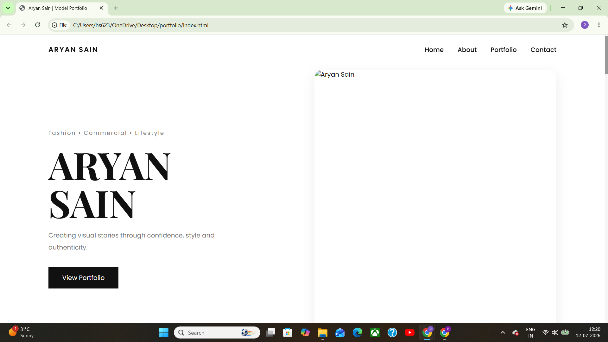
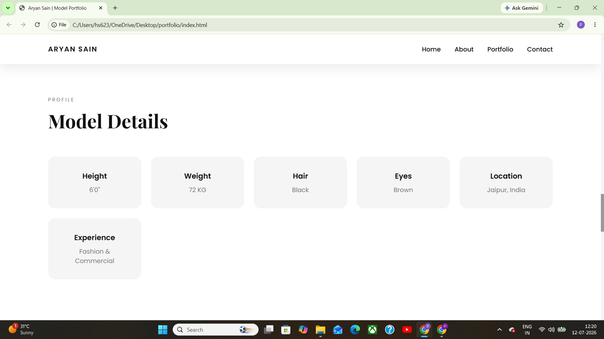
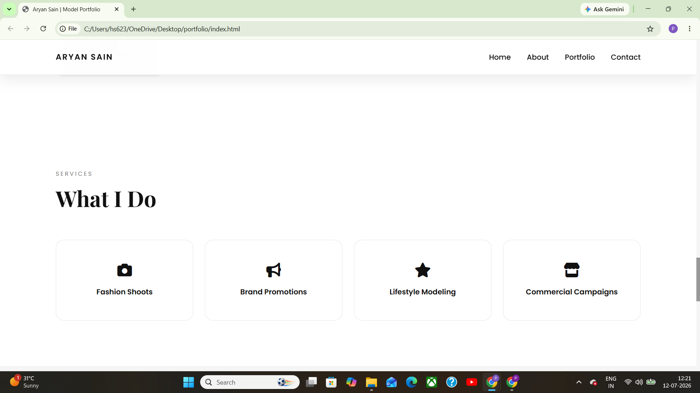
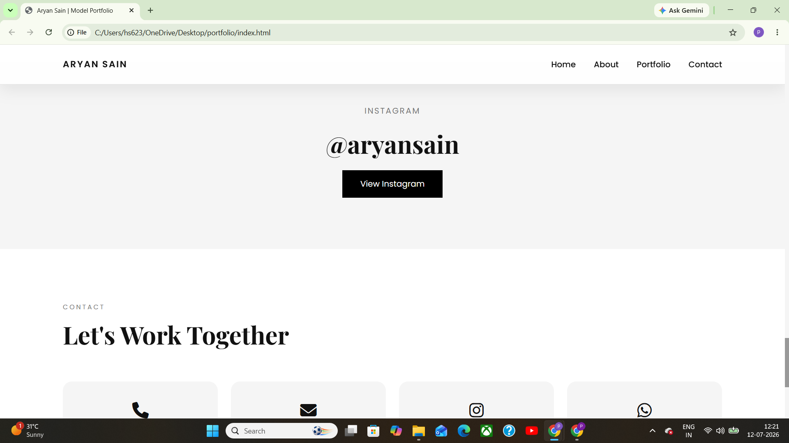

# 🌟 Model Portfolio Website

A modern, elegant, and fully responsive portfolio website designed for a fashion model. This project focuses on delivering a clean user interface, engaging user experience, and seamless responsiveness across all devices.

The website showcases a professional portfolio with smooth scrolling, interactive galleries, modern animations, and mobile-friendly navigation.

---

## 🚀 Live Demo

🔗 https://YOUR-GITHUB-PAGES-LINK

---

## 📸 Project Preview









---

# ✨ Features

- 📱 Fully Responsive Design
- 🎨 Modern and Clean User Interface
- 🖼️ Interactive Portfolio Gallery
- 🔍 Image Lightbox Preview
- ⚡ Smooth Scrolling Navigation
- 📌 Sticky Navigation Bar
- 🎭 Scroll Animations
- 📞 Contact Section
- 📷 Professional Portfolio Layout
- 🚀 Optimized Performance

---

# 🛠️ Built With

- HTML5
- CSS3
- JavaScript (ES6)
- CSS Flexbox
- CSS Grid
- Media Queries

---

# 📂 Folder Structure

```
model-portfolio-website/
│
├── assets/
│   ├── home.png
│   ├── about.png
│   ├── gallery.png
│   ├── contact.png
│   └── images/
│
├── index.html
├── style.css
├── script.js
└── README.md
```

---

# 💡 Project Highlights

This project demonstrates:

- Responsive Web Design
- DOM Manipulation
- Event Handling
- Mobile Navigation
- Interactive Image Gallery
- CSS Animations
- Smooth User Experience
- Clean UI/UX Design
- Organized File Structure

---

# 🤖 AI-Assisted Development

Modern software development often involves AI-assisted workflows to improve productivity.

For this project, AI tools were used to support the development process by assisting with:

- Brainstorming design ideas
- Refining the user interface
- Debugging and troubleshooting
- Improving code readability
- Accelerating development

The project was customized, implemented, tested, and fully understood by me before deployment.

---

# 📚 What I Learned

While building this project, I strengthened my understanding of:

- Responsive Web Design
- HTML Semantic Structure
- CSS Layout Techniques
- Flexbox & Grid
- JavaScript DOM Manipulation
- Event Listeners
- Mobile Navigation
- Image Gallery Implementation
- Project Organization
- Git & GitHub Workflow

---

# 🚀 Future Improvements

- Contact Form Backend
- Dark Mode
- Better Image Optimization
- SEO Enhancements
- Performance Optimization
- Accessibility Improvements

---

# 👨‍💻 About This Project

This website was developed as a custom portfolio website for a client/friend to showcase professional work and photography.

It demonstrates my frontend development skills by combining responsive layouts, interactive JavaScript functionality, and modern UI design.

---

# 👨‍💻 Author

**Prateek Singh Shekhawat**

📍 Jaipur, Rajasthan, India

💻 Frontend Developer

🔗 GitHub:
https://github.com/prateek-singh-1210

---

## ⭐ If you like this project

Give it a ⭐ on GitHub!

Feedback and suggestions are always welcome.
